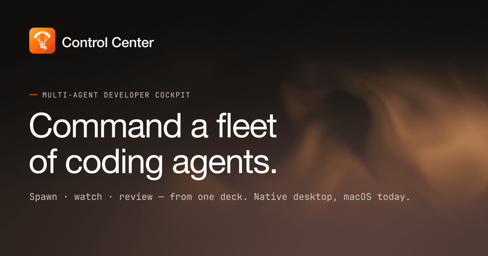

<div align="center">


# Control Center

**The cockpit for multi-agent software development.**

Spawn and direct autonomous coding agents, watch their work unfold in real time,
and review and merge what they ship — from one quiet, well-instrumented deck.

[](#install)
[](https://flutter.dev)
[](#works-with-the-tools-you-already-run)
[](#)
[](https://usectrl.dev/manual)
[](LICENSE)

[Features](#features) · [Install](#install) · [How it works](#how-it-works) · [Documentation](https://usectrl.dev/manual)

<br />



</div>

---

Control Center gives you command over a fleet of AI coding agents. Each agent runs
on its own branch, in its own copy-on-write worktree, producing pull requests, logs,
costs, and messages in parallel — all behind a native desktop app with GitHub and
Linear integration.

> **Spawning ten agents is easy. Knowing which one needs you isn't.** Git, your
> terminal, and the GitHub UI were built for one person writing one branch. The hard
> part was never any single action — it's holding the whole fleet in view at once,
> seeing what's blocked or waiting on you, and acting in one or two moves without
> losing the thread. That's what Control Center is for.

> [!NOTE]
> Control Center ships as a native desktop build, **available today on macOS**.
> Windows and Linux are close behind.

## Features

<table>
<tr>
<td width="50%" valign="top">

### See the whole fleet at a glance

Thinking, running, blocked, failed, idle — every agent's state reads at a glance.
Presence reports real work, never decoration.

- Live status and presence for every agent and run
- Per-run token cost and last-output age, rolled up
- Ownership and attribution stay legible, solo or team

[The agent model →](https://usectrl.dev/manual/concepts/agent-model/)

</td>
<td width="50%" valign="top">

### Review and merge what the fleet ships

Priority pull requests surface first. Read the diff, comment, dispatch reviewer
agents, and land a ship / hold / block verdict — without leaving the deck.

- Built-in diff viewer with syntax highlighting and inline threads
- Inline comments and suggested edits that sync back to GitHub
- AI reviewers with P0–P3 findings and a rolled-up verdict

[Review and merge a PR →](https://usectrl.dev/manual/guides/review-merge-pr/)

</td>
</tr>
<tr>
<td width="50%" valign="top">

### Orchestrate the work as a pipeline

Compose steps into a DAG — prompt an agent, run a script, fan out reviewers, join
the results. Every node carries its own retry and continue-on-fail policy.

- Router and join nodes for conditional, parallel work
- Triggers: manual, scheduled (cron), or off a domain event
- Resumable runs with per-run cost and token totals

[Pipelines →](https://usectrl.dev/manual/concepts/pipelines/)

</td>
<td width="50%" valign="top">

### One ticket, from request to merge

The single unit of work the whole fleet shares — vendor-agnostic, synced with
Linear both ways, and coupled to the pipeline that delivers it.

- Bidirectional Linear sync — status, assignee, comments
- Coupled to a pipeline run that drives the work end to end
- An execution lock — one owner at a time, never a double-claim

[Tickets →](https://usectrl.dev/manual/concepts/tickets/)

</td>
</tr>
<tr>
<td width="50%" valign="top">

### Isolated by default, open by design

Every conversation runs over copy-on-write worktrees inside an OS-native sandbox,
with credentials minted per launch and revoked on teardown.

- Seatbelt (macOS) / bubblewrap (Linux) with capability controls
- Secrets brokered in memory, never written to disk
- 71 typed tools over MCP / JSON-RPC for any client

[Sandbox security →](https://usectrl.dev/manual/concepts/sandbox-security/) · [MCP server →](https://usectrl.dev/manual/guides/mcp-server/)

</td>
<td width="50%" valign="top">

### Knowledge that compounds across runs

Each run opens with more context — and you keep more control — than the run
before it.

- Memory: facts, policies, domains over a hybrid FTS + vector graph
- Role-gated reads — no agent sees beyond its scope
- Code graph: tree-sitter callers, callees, and impact radius

[Memory & knowledge →](https://usectrl.dev/manual/concepts/memory-knowledge/) · [Code search →](https://usectrl.dev/manual/guides/code-search/)

</td>
</tr>
<tr>
<td width="50%" valign="top">

### Capture meetings as notes

Record a call and walk away with a clean writeup. Audio is captured, transcribed,
and summarized entirely on-device — nothing leaves the machine.

- System + microphone capture with on-device Whisper transcription
- Speaker diarization, then an AI summary with action items and decisions
- Action items link straight to tickets; notes stay local and private

[Meetings →](https://usectrl.dev/manual/concepts/meetings/)

</td>
<td width="50%" valign="top">

### A calendar that knows your fleet

Connect Google Calendar, see your day, and turn any event into a
recorded, summarized meeting in one click.

- Per-workspace Google sign-in, event sync, and RSVP to invitations
- Month, week, and agenda views with "meeting starting soon" alerts
- Start a recording seeded from an event and link it back

[Calendar →](https://usectrl.dev/manual/concepts/calendar/)

</td>
</tr>
</table>

## Works with the tools you already run

| Integration | What it does |
|---|---|
| **GitHub** | Pull requests, reviews, inline comments, checks, and user profiles |
| **Linear** | Bidirectional ticket sync — status, assignee, and comments |
| **Google Calendar** | Per-workspace event sync, RSVP, "starting soon" alerts, and record-and-link |
| **MCP** | 71 typed tools over JSON-RPC, callable by any MCP client |
| **Agent CLIs** | Claude Code, Codex, and Pi — auto-detected on your `PATH` |

---

## Install

### macOS

```bash
brew tap control-center/tap
brew install --cask control-center
```

Or download the latest `.dmg` (Apple Silicon) from
[Releases](https://github.com/SamuelAlev/control-center/releases/latest).

Free and open source · auto-updates · macOS 13 or later.

> [!IMPORTANT]
> Before your first run you'll need **Git**, at least one agent CLI
> (Claude Code, Codex, or Pi), and a **GitHub personal access token** with repo and PR
> permissions — or the `gh` CLI, which Control Center detects automatically. Tokens are
> stored in your system keychain, never on disk.

### Build from source

Requires the [Flutter](https://docs.flutter.dev/get-started/install) SDK (desktop enabled).

```bash
flutter pub get
flutter pub run build_runner build --delete-conflicting-outputs
flutter gen-l10n
flutter run -d macos   # or windows, linux
```

> [!IMPORTANT]
> **macOS contributors — sign with your own Apple team for secure storage to work.**
> Credentials live in the macOS *data-protection keychain*, which requires the app to be
> signed by an Apple Developer team (a **free** Apple ID works for local dev). The debug
> entitlement uses `$(DEVELOPMENT_TEAM)`, so you don't edit any source — just run, once:
>
> ```bash
> # add your Apple ID in Xcode → Settings → Accounts first, then:
> bash macos/scripts/create_local_signing_cert.sh
> ```
>
> It writes a git-ignored `Signing.local.xcconfig` set up for **automatic signing** under your
> team. Because the app uses the Keychain Sharing capability, mint the development provisioning
> profile once (`flutter run` can't — it doesn't pass `-allowProvisioningUpdates`):
>
> ```bash
> flutter build macos --config-only
> xcodebuild -workspace macos/Runner.xcworkspace -scheme Runner \
>   -configuration Debug -allowProvisioningUpdates build
> ```
>
> Then `flutter run -d macos` works (the script prints these commands too). An unsigned/no-team
> build still launches, but secure storage (GitHub/Linear/Google login) is unavailable until you
> sign. Windows/Linux need no signing to run locally.

## How it works

1. **Create a workspace** — your top-level container for agents, repos, channels, and
   memory. The first workspace seeds a CEO agent that can hire and coordinate others.
2. **Add repositories** — each agent conversation gets its own copy-on-write worktree
   branch, so agents work in parallel without ever touching your source checkout.
3. **Dispatch an agent** — mention `@agent` in a channel. It gets an isolated worktree,
   a prompt assembled from its role, persona, skills, and context, runs in a
   capability-gated sandbox, and streams its thinking and output back in real time.
4. **Review and merge** — when the agent finishes it opens a pull request. Review the
   diff and merge, all without leaving the app.

Every conversation runs in one of three **modes** — `chat`, `plan`, or `review` — each
gating the system prompt, whether the agent can write files, and which tools it can reach.

> [!TIP]
> The whole surface — agents, review, the code graph, memory, and ticketing — is exposed
> over an MCP / JSON-RPC server. Point any MCP client at it and drive Control Center the
> same way the app drives itself.

---

## Documentation

| Resource | What's there |
|---|---|
| [usectrl.dev/manual](https://usectrl.dev/manual) | The full manual — tutorials, guides, concepts, and reference |
| [Quick start](https://usectrl.dev/manual/quick-start/) | Zero to your first dispatched agent in five minutes |
| [ARCH.md](ARCH.md) | Architecture, layering, and the technology stack |
| [GLOSSARY.md](GLOSSARY.md) | The ubiquitous-language glossary for the domain |

## Built with

Flutter (desktop), Riverpod, Drift (SQLite with FTS5 + vector search), go_router,
a token-based Material 3 base theme under the in-repo cc_ui design system, dio
(GitHub, Linear & Google Calendar), tree-sitter, on-device Whisper transcription
with speaker diarization, and an MCP / JSON-RPC tool server.
See [ARCH.md](ARCH.md) for the full picture.
