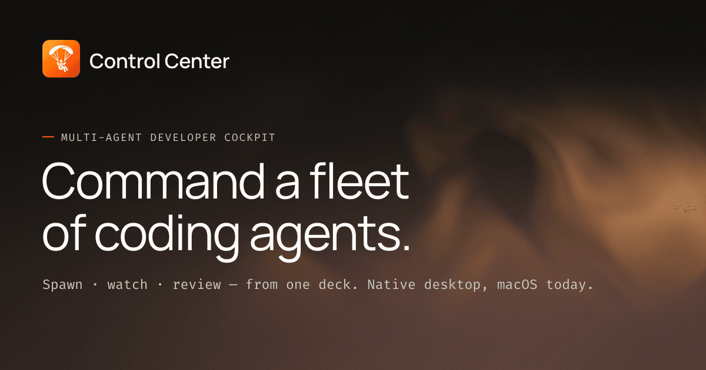

<div align="center">


# Control Center

**The cockpit for multi-agent software development.**

Spawn and direct autonomous coding agents, watch their work unfold in real time,
and review and merge what they ship, from one quiet, well-instrumented deck.

[](#install)
[](https://flutter.dev)
[](#works-with-the-tools-you-already-run)
[](#)
[](https://usectrl.dev/manual)
[](LICENSE)

[Features](#features) · [Install](#install) · [How it works](#how-it-works) · [Documentation](https://usectrl.dev/manual)

<br />



</div>

---

Control Center gives you command over a fleet of AI coding agents. Each agent runs
on its own branch, in its own copy-on-write worktree, producing pull requests, logs,
costs and messages in parallel, all behind a native desktop app with GitHub, Linear,
and Slack integration.

> **Spawning ten agents is easy. Knowing which one needs you isn't.** Git, your
> terminal and the GitHub UI were built for one person writing one branch. The hard
> part was never any single action. It's holding the whole fleet in view at once,
> seeing what's blocked or waiting on you and acting in one or two moves without
> losing the thread. That's what Control Center is for.

## Features

<table>
<tr>
<td width="50%" valign="top">

### Drive the fleet from a message

Messaging is the primary way to use agents. Open a channel or @-mention an agent in a
channel and it dispatches into its own worktree, thinking, tool calls and
output streaming back in real time.

- Channels with threads and @-mentions
- Agents that ask a question render inline as a form and route your answer back
- Review channels, plan mode and parallel dispatch from one room

[Chat with an agent →](https://usectrl.dev/manual/guides/chat-with-agent/) · [Channels →](https://usectrl.dev/manual/guides/channels/)

</td>
<td width="50%" valign="top">

### Follow the fleet from your phone

Pair your phone with **[Remote](https://remote.usectrl.dev/)** and keep up from
anywhere, read messages, reply, triage tickets, without your data ever reaching a
third party in readable form.

- QR pairing, then the best reachable path: loopback, LAN, tailnet, or TLS
- Behind NAT it falls back to a relay that only ever forwards end-to-end-sealed frames
- A read-mostly companion: default-deny tools, per-workspace scoping
- Switch workspaces on the phone without touching the desktop

[Remote control and mobile →](https://usectrl.dev/manual/concepts/remote-control/) · [Pair a device →](https://usectrl.dev/manual/guides/pair-a-device/)

</td>
</tr>

<tr>
<td colspan="2" valign="top">

### Drive the fleet from Slack

A Slack thread becomes a Control Center channel. @-mention the bot and an agent
wakes in its own worktree. The turn streams back into the thread as a live task
card and the answer lands under it.

- One card per turn: setup (`Cloning acme/widgets…`), thinking, tools run and a link back into Control Center
- `/cc` files a ticket or links a chat account; unlinked or unauthorized mentions are refused with an explanation
- Outbound Socket Mode, so a laptop behind NAT needs no inbound port or tunnel
- Discord and Microsoft Teams are incoming

[Chat bridges →](https://usectrl.dev/manual/concepts/chat-bridges/) · [Connect Slack →](https://usectrl.dev/manual/guides/slack-integration/)

</td>
</tr>

<tr>
<td width="50%" valign="top">

### See the whole fleet at a glance

Thinking, running, blocked, failed, idle. Every agent's state reads at a glance.
Presence reports real work, never decoration.

- Live status and presence for every agent and run
- Per-run token cost and last-output age, rolled up
- Humans and agents share one roster; follow an agent working, or steer and take over
- Ownership and attribution stay legible, solo or team

[The agent model →](https://usectrl.dev/manual/concepts/agent-model/)

</td>
<td width="50%" valign="top">

### Review and merge what the fleet ships

Priority pull requests surface first. Read the diff, comment, dispatch reviewer
agents and land a ship / hold / block verdict, without leaving the deck.

- Built-in diff viewer with syntax highlighting and inline threads
- Inline comments and suggested edits that sync back to GitHub
- AI reviewers with P0-P3 findings and a rolled-up verdict

[Review and merge a PR →](https://usectrl.dev/manual/guides/review-merge-pr/)

</td>
</tr>
<tr>
<td width="50%" valign="top">

### Orchestrate the work as a pipeline

Compose steps into a DAG, prompt an agent, run a script, fan out reviewers, join
the results. Every node carries its own retry and continue-on-fail policy.

- Router and join nodes for conditional, parallel work
- Triggers: manual, scheduled (cron), or off a domain event
- Resumable runs with per-run cost and token totals
- Or hand the goal to an agent. It proposes a whole-team plan, you approve once and a pipeline runs it
- Edit the plan on a canvas first: a per-step cost, time and risk estimate, with plan diff versioning and partial approval

[Pipelines →](https://usectrl.dev/manual/concepts/pipelines/)

</td>
<td width="50%" valign="top">

### One ticket, from request to merge

The single unit of work the whole fleet shares, vendor-agnostic, synced with
Linear both ways and coupled to the pipeline that delivers it.

- Bidirectional Linear sync: status, assignee, comments
- Coupled to a pipeline run that drives the work end to end
- An execution lock, one owner at a time, never a double-claim

[Tickets →](https://usectrl.dev/manual/concepts/tickets/)

</td>
</tr>
<tr>
<td width="50%" valign="top">

### Isolated by default, open by design

Every conversation runs over its own copy-on-write worktree, with credentials
minted per launch and revoked on teardown and every mutating action checked.

- Seatbelt (macOS) / bubblewrap (Linux) wrap agent command execution, with your registered checkouts deny-listed for writes
- Copy-on-write worktrees, so agents never touch your source checkout
- Secrets brokered in memory, never written to disk
- One unified action-guardrail policy (allow / prompt / deny) scopes to workspace, channel, or agent and fails closed
- 103 typed tools over MCP / JSON-RPC for any client

> [!NOTE]
> The OS sandbox needs a host backend: macOS always has one, Linux needs `bwrap`
> and `socat` and Windows has none — there, runs are bounded by the other layers
> above. `--sandbox off` disables it deliberately. See
> [Sandbox and security](https://usectrl.dev/manual/concepts/sandbox-security/).

[Sandbox security →](https://usectrl.dev/manual/concepts/sandbox-security/) · [MCP server →](https://usectrl.dev/manual/guides/mcp-server/)

</td>
<td width="50%" valign="top">

### Knowledge that compounds across runs

Each run opens with more context and you keep more control, than the run
before it.

- Memory: facts, policies, domains over a hybrid FTS + vector graph
- Role-gated reads, no agent sees beyond its scope
- Code graph: tree-sitter callers, callees and impact radius

[Memory & knowledge →](https://usectrl.dev/manual/concepts/memory-knowledge/) · [Code search →](https://usectrl.dev/manual/guides/code-search/)

</td>
</tr>
<tr>
<td width="50%" valign="top">

### Capture meetings as notes

Record a call and walk away with a clean writeup. Capture, transcription and
speaker diarization all run on-device — the audio never leaves the machine.

- System + microphone capture, transcribed on-device
- Speaker diarization, then an AI summary with action items and decisions
- Action items link straight to tickets

> [!NOTE]
> The recording and its transcript stay on the machine running the server. The
> final **summarization** step is an ordinary agent run, so it sends the
> transcript to whichever model provider that agent uses. Point it at a local
> provider (Ollama, LM Studio) to keep the whole pipeline on-device.

[Meetings →](https://usectrl.dev/manual/concepts/meetings/)

</td>
<td width="50%" valign="top">

### A calendar that knows your fleet

Connect Google Calendar, see your day and turn any event into a
recorded, summarized meeting in one click.

- Per-workspace Google sign-in, event sync and RSVP to invitations
- Month, week and agenda views with "meeting starting soon" alerts
- Start a recording seeded from an event and link it back

[Calendar →](https://usectrl.dev/manual/concepts/calendar/)

</td>
</tr>
<tr>
<td width="50%" valign="top">

### One roster for humans and agents

A workspace is multi-user. Invite a teammate, each of you keeps your own device
credentials and read state and you see each other's presence next to the agents'.

- Self-hosted-first identity: first user is admin, invite by link, passkeys, OIDC optional
- Graduated roles (owner / admin / member / viewer / guest) and per-repo grants
- Presence, follow-mode and shared channel notes; attribution on every action

</td>
<td width="50%" valign="top">

### Reach anything in one keystroke

A ⌘K omnibox spans every action, entity and agent. A "needs me" inbox collects only what blocks something. Every mutation is idempotent and undoable.

- ⌘K command palette, keyboard-first, with a cheat-sheet overlay
- Universal undo with declared undo classes; idempotent retries on reconnect
- Deterministic preview/dry-run for risky actions; offline-first with a pending queue

</td>
</tr>
</table>

## Works with the tools you already run

| Integration                               | What it does                                                                                                                                                            |
| ----------------------------------------- | ----------------------------------------------------------------------------------------------------------------------------------------------------------------------- |
| **GitHub**                                | Pull requests, reviews, inline comments, checks and user profiles                                                                                                       |
| **Linear**                                | Bidirectional ticket sync: status, assignee and comments                                                                                                                |
| **Slack**                                 | Chat bridge: @-mention the bot, follow a live task card in-thread, file tickets with `/cc`. Discord and Teams incoming                                                  |
| **Google Calendar**                       | Per-workspace event sync, RSVP, "starting soon" alerts and record-and-link                                                                                              |
| **MCP**                                   | 103 typed tools over JSON-RPC, callable by any MCP client, plus a client that bridges in external MCP servers                                                           |
| **Agent runtimes**                        | A built-in agent runtime (direct provider API, no external CLI), plus Claude Code, Codex and Pi auto-detected on the server host's `PATH` and any ACP-compatible runner |
| **[Remote](https://remote.usectrl.dev/)** | The phone companion: messages, replies and ticket triage from anywhere, over a direct path or an end-to-end-sealed relay                                                |

---

## Install

### In your browser — nothing to download

Open **[app.usectrl.dev](https://app.usectrl.dev)**. It is the same application with the
same features.

A browser tab can't host the server, so you supply one: run `cc_server` on your own
machine and connect to `ws://localhost:9030` (no certificate needed — browsers trust
`localhost`), or point it at a server on another machine reachable over `wss://`, whether
that's real TLS, a reverse proxy, a VPN, or a tunnel. See
[Run a headless server](https://usectrl.dev/manual/guides/run-headless-server/).

### macOS

```bash
brew tap control-center/tap
brew install --cask control-center
```

Or download the latest `.dmg` (Apple Silicon) from
[Releases](https://github.com/SamuelAlev/control-center/releases/latest).
Intel Macs build from source.

### Windows and Linux

Download from [Releases](https://github.com/SamuelAlev/control-center/releases/latest):
the Windows `-x64-setup.exe` installer or portable `.zip`, or the Linux
`.AppImage` or `.tar.gz`. Standalone `cc_server` archives ship for all three
platforms and `cc-server` / `cc-webapp` / `cc-remote`
images are published to GHCR.

> [!NOTE]
> The Windows build is new and has not yet been through a hand-checked release.
> On Windows there are no copy-on-write worktrees (plain `git worktree` is the
> backend) and no code-server.

Free and open source · auto-updates · macOS 13+, Windows 10+, or a modern Linux desktop.

> [!IMPORTANT]
> Before your first run you'll need **Git**, an **agent runtime** (either the built-in
> runtime with a model-provider API key, or an agent CLI like Claude Code, Codex, or Pi
> that Control Center detects on your `PATH`) and a **GitHub personal access token** with
> repo and PR permissions, or the `gh` CLI, which Control Center detects automatically.
> Tokens are stored in your system keychain, never on disk.

### Build from source

Requires the [Flutter](https://docs.flutter.dev/get-started/install) SDK (desktop enabled).

```bash
scripts/natives/build_natives.sh   # required — a missing native is a hard boot failure
fvm flutter pub get
fvm flutter pub run build_runner build --delete-conflicting-outputs
fvm flutter gen-l10n
fvm flutter run -d macos   # or windows, linux
```

The SDK is pinned with [fvm](https://fvm.app), so prefix every Flutter/Dart
command with `fvm`. Native libraries are required and have no degraded mode:
build them first or `cc_server` refuses to boot and names the offender.

Windows and Linux need nothing further. On macOS, secure storage (GitHub/Linear/Google
sign-in) needs the app signed by an Apple team — a **free** Apple ID is enough and it is a
one-time setup: see [Local development signing](RELEASING.md#local-development-signing-macos)
in `RELEASING.md`. Everything else runs unsigned.

## How it works

1. **Create a workspace**, your top-level container for agents, repos, channels and
   memory. The first workspace seeds a CEO agent that can hire and coordinate others.
2. **Add repositories**, each agent channel gets its own copy-on-write worktree
   branch, so agents work in parallel without ever touching your source checkout.
3. **Dispatch an agent**, mention `@agent` in a channel, or mention the bot from a
   bridged Slack thread. It gets an isolated worktree, a prompt assembled from its
   role, persona, skills and context, capability-gated credentials minted for that
   launch and every mutating action checked against your guardrails — then it
   streams its thinking and output back in real time.
4. **Review and merge**, when the agent finishes it opens a pull request. Review the
   diff and merge, all without leaving the app.

Every conversation runs in one of four **modes** (`chat`, `plan`, `review`, or
`orchestrate`), each gating the system prompt, whether the agent can write files and
which tools it can reach. Mode is per conversation, so one agent can be in different
modes in different channels.

> [!TIP]
> The whole surface (agents, review, the code graph, memory and ticketing) is exposed
> over an MCP / JSON-RPC server. Point any MCP client at it and drive Control Center the
> same way the app drives itself.

---

## Documentation

| Resource                                               | What's there                                               |
| ------------------------------------------------------ | ---------------------------------------------------------- |
| [usectrl.dev/manual](https://usectrl.dev/manual)       | The full manual: tutorials, guides, concepts and reference |
| [Quick start](https://usectrl.dev/manual/quick-start/) | Zero to your first dispatched agent in five minutes        |
| [ARCH.md](ARCH.md)                                     | Architecture, layering and the technology stack            |
| [GLOSSARY.md](GLOSSARY.md)                             | The ubiquitous-language glossary for the domain            |
