<h1 align="center">
   Control Center
</h1>

<p align="center">
  <a href="https://github.com/SamuelAlev/control-center/releases/latest"></a>
  
  <a href="lib/l10n"></a>
  <a href="https://usectrl.dev/manual/"></a>
  <a href="LICENSE"></a>
</p>

<p align="center">
  <strong>Many moving parts. One Control Center.</strong><br/>
  A home for your code, agents, reviews and everything else that makes a developer day.
</p>

<h3 align="center"><a href="#install"><ins>Get Control Center</ins></a> · <a href="https://usectrl.dev/demo"><ins>Explore the live demo</ins></a></h3>

<p align="center">
  <a href="https://usectrl.dev"><picture><source media="(prefers-reduced-motion: reduce)" srcset="assets/readme/hero-still.webp">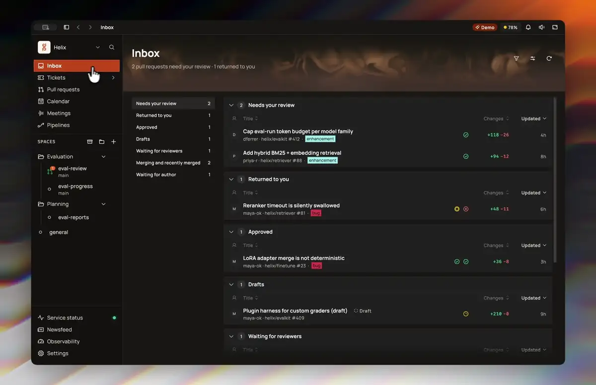</picture></a>
</p>

Bring tickets, code reviews, AI agents, meetings and pipelines together. Control Center
is a free, open-source developer workspace for desktop, web and phone. Agents are one
part of the desk, not a prerequisite for using the rest.

One server owns the databases, credentials, external APIs and agent execution. The
desktop app, the browser and a paired phone all render that same server-owned
workspace.

## Features

<table>
<tr>
<td width="50%" valign="middle">

### Parallel agents

Give each task an isolated Git worktree. Follow the run, steer an agent or take over
without disturbing the rest.

[Run agents in parallel →](https://usectrl.dev/manual/guides/parallel-agents/)

</td>
<td width="50%">
  <a href="https://usectrl.dev/manual/guides/parallel-agents/"><picture><source media="(prefers-reduced-motion: reduce)" srcset="assets/readme/parallel-agents-still.webp">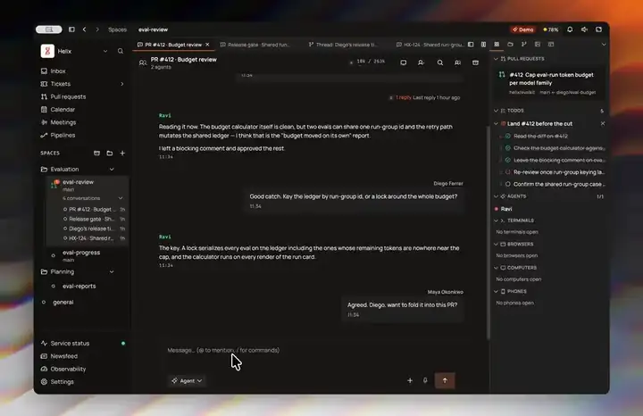</picture></a>
</td>
</tr>
<tr>
<td width="50%" valign="middle">

### Approve a push before it runs

Put Git pushes, PR publishing and other guarded actions behind an approval. Review what
the agent is about to do before it changes anything. No approver connected? The action
is denied. Your server enforces permissions, not a prompt.

[Configure action approvals →](https://usectrl.dev/manual/guides/configure-guardrails/)

</td>
<td width="50%">
  <a href="https://usectrl.dev/manual/guides/configure-guardrails/"><picture><source media="(prefers-reduced-motion: reduce)" srcset="assets/readme/approvals-still.webp">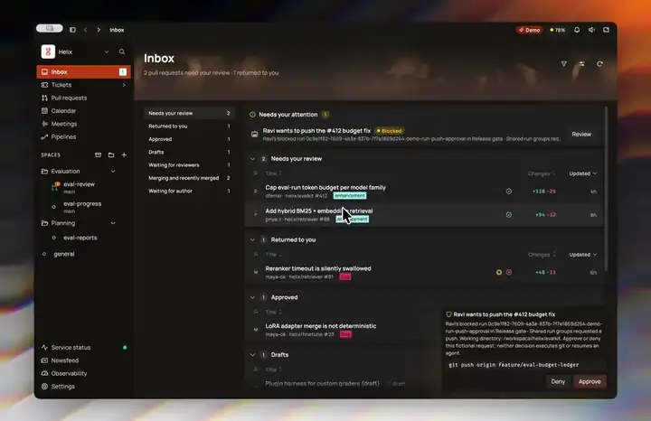</picture></a>
</td>
</tr>
<tr>
<td width="50%" valign="middle">

### Pull request review

Read diffs with discussions and checks alongside. Add an AI review when it helps, then
publish with your own forge account.

[Review a pull request →](https://usectrl.dev/manual/guides/review-merge-pr/)

</td>
<td width="50%">
  <a href="https://usectrl.dev/manual/guides/review-merge-pr/"><picture><source media="(prefers-reduced-motion: reduce)" srcset="assets/readme/pr-review-still.webp">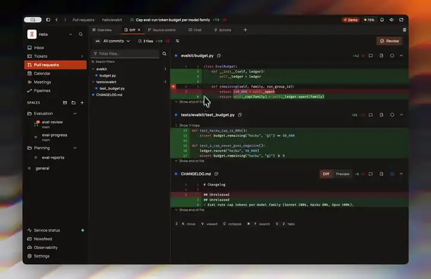</picture></a>
</td>
</tr>
<tr>
<td width="50%" valign="middle">

### Connected tickets

Sync Linear, set priorities and assign the work. Link the ticket to the conversation
where it gets done.

[Manage tickets →](https://usectrl.dev/manual/guides/manage-tickets/)

</td>
<td width="50%">
  <a href="https://usectrl.dev/manual/guides/manage-tickets/"><picture><source media="(prefers-reduced-motion: reduce)" srcset="assets/readme/tickets-still.webp">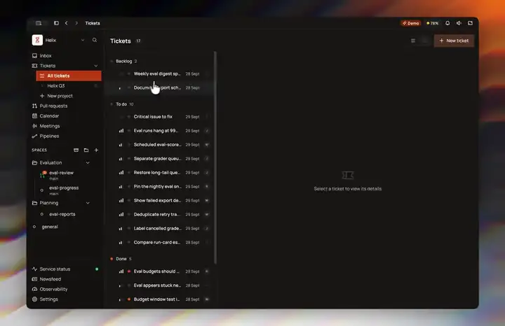</picture></a>
</td>
</tr>
<tr>
<td width="50%" valign="middle">

### Meeting notes

Record and transcribe on your server. Keep the decisions and action items after the
call ends.

[Record a meeting →](https://usectrl.dev/manual/guides/record-meeting/)

</td>
<td width="50%">
  <a href="https://usectrl.dev/manual/guides/record-meeting/"><picture><source media="(prefers-reduced-motion: reduce)" srcset="assets/readme/meetings-still.webp">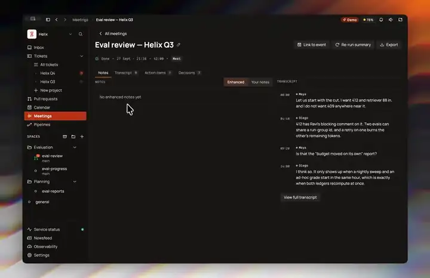</picture></a>
</td>
</tr>
<tr>
<td width="50%" valign="middle">

### Repeatable pipelines

Build a workflow once. Run it on a schedule, from an event or by hand, and inspect every
step.

[Build a pipeline →](https://usectrl.dev/manual/guides/create-pipeline/)

</td>
<td width="50%">
  <a href="https://usectrl.dev/manual/guides/create-pipeline/"><picture><source media="(prefers-reduced-motion: reduce)" srcset="assets/readme/pipelines-still.webp">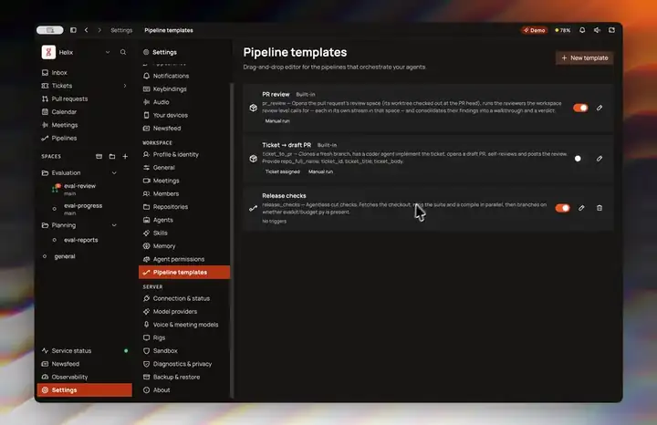</picture></a>
</td>
</tr>
<tr>
<td width="50%" valign="middle">

### Account switching

Choose the accounts each agent can use, then rotate across them without losing the
run's context.

[Manage model providers →](https://usectrl.dev/manual/guides/adapters/)

</td>
<td width="50%">
  <a href="https://usectrl.dev/manual/guides/adapters/"><picture><source media="(prefers-reduced-motion: reduce)" srcset="assets/readme/account-switching-still.webp">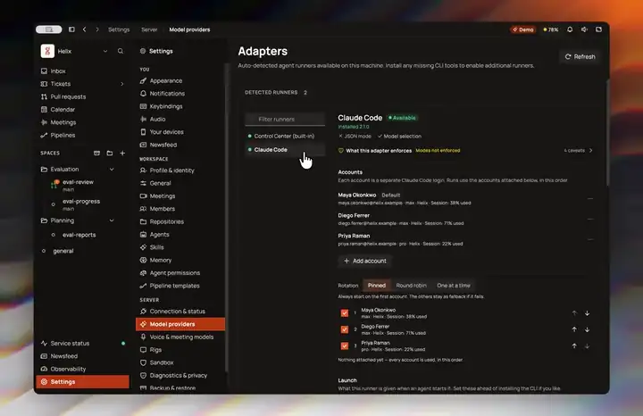</picture></a>
</td>
</tr>
<tr>
<td width="50%" valign="middle">

### Usage quota

Check provider allowance and reset times before starting the next run.

[Manage costs →](https://usectrl.dev/manual/guides/manage-costs/)

</td>
<td width="50%">
  <a href="https://usectrl.dev/manual/guides/manage-costs/"><picture><source media="(prefers-reduced-motion: reduce)" srcset="assets/readme/usage-quota-still.webp">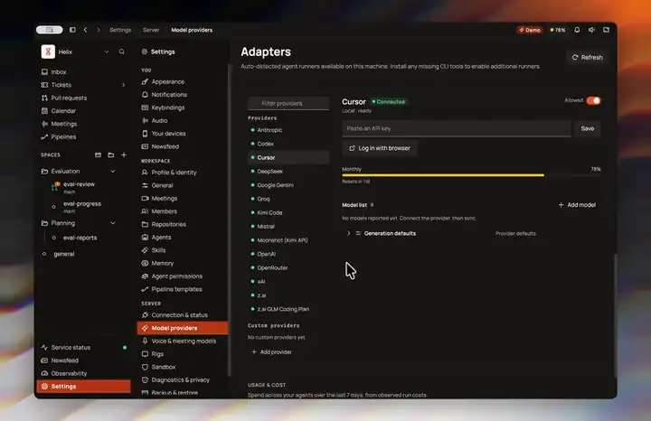</picture></a>
</td>
</tr>
<tr>
<td width="50%" valign="middle">

### Observability

Follow live agents and inspect run costs, token use and latency in your workspace.

[Inspect agent runs →](https://usectrl.dev/manual/guides/manage-costs/)

</td>
<td width="50%">
  <a href="https://usectrl.dev/manual/guides/manage-costs/"><picture><source media="(prefers-reduced-motion: reduce)" srcset="assets/readme/observability-still.webp">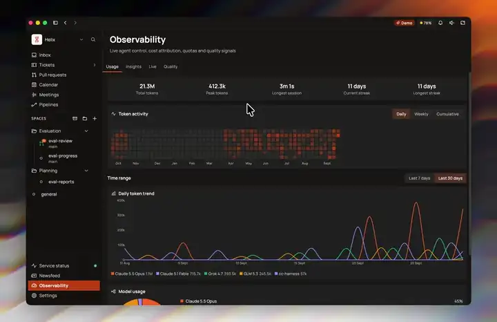</picture></a>
</td>
</tr>
<tr>
<td width="50%" valign="middle">

### Skill and agent editors

Edit workspace skills and configure each agent's model, instructions and permissions.

[Manage skills →](https://usectrl.dev/manual/guides/manage-skills/)

</td>
<td width="50%">
  <a href="https://usectrl.dev/manual/guides/manage-skills/"><picture><source media="(prefers-reduced-motion: reduce)" srcset="assets/readme/editors-still.webp">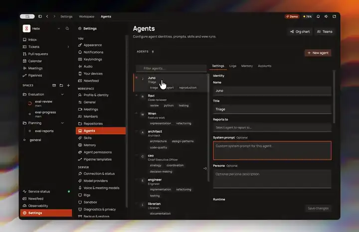</picture></a>
</td>
</tr>
<tr>
<td width="50%" valign="middle">

### Soundscapes and focus

Run a timed focus session, quiet notifications and shape the soundscape playing under
it. Focus, relax, sleep and rise moods follow the time of day and the weather.

[Use focus mode →](https://usectrl.dev/manual/guides/focus-mode/)

</td>
<td width="50%">
  <a href="https://usectrl.dev/manual/guides/focus-mode/"><picture><source media="(prefers-reduced-motion: reduce)" srcset="assets/readme/focus-still.webp">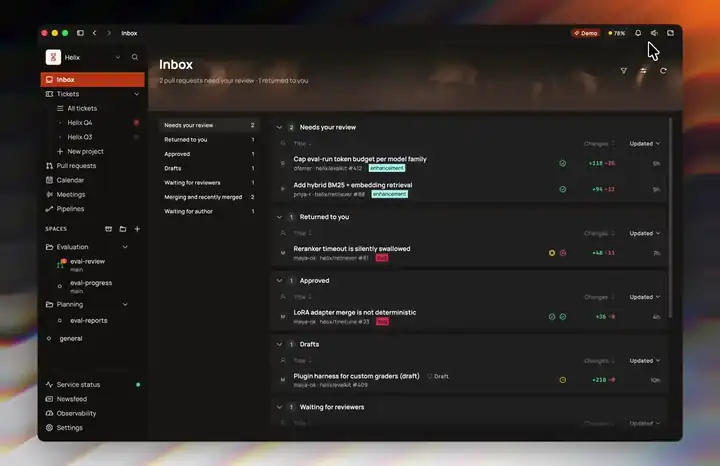</picture></a>
</td>
</tr>
</table>

## Your desk is a place. Your work isn't.

The smaller pieces, sorted by where you are when the work needs you.

<table>
<tr>
<td width="50%" valign="top">

#### At your desk

**[One inbox](https://usectrl.dev/manual/guides/triage-inbox/)**<br/>
Reviews, approvals and blockers wait in a single queue. The command palette takes you
to the next one.

**[Plan Studio](https://usectrl.dev/manual/guides/plan-studio/)**<br/>
Ask for a plan in orchestrate mode and get proposed roles, child tickets and steps.
Nobody is hired until you approve.

**[Newsfeed](https://usectrl.dev/manual/guides/newsfeed/)**<br/>
A personal RSS reader. It stays yours, outside the shared workspace.

</td>
<td width="50%" valign="top">

#### Away from it

**[Your phone](https://usectrl.dev/manual/concepts/remote-control/)**<br/>
Pair it once, then follow runs and answer approvals from anywhere. The phone shows the
work; the server does it.

**[Any browser](https://app.usectrl.dev)**<br/>
The same app at app.usectrl.dev, connected to a server you run.

**[A Slack thread](https://usectrl.dev/manual/concepts/chat-bridges/)**<br/>
Mention the bot and an agent picks up the work in its own worktree. You follow it
without leaving the thread.

</td>
</tr>
</table>

## Bring the tools you already work with

Connected through your server, not another copy of your day. Each connection, by what
comes in and what goes back out:

| Connection                          | Comes in                                                                       | Goes out                                                  |
| ----------------------------------- | ------------------------------------------------------------------------------ | --------------------------------------------------------- |
| **GitHub · GitLab · Bitbucket Cloud** | Pull requests, diffs, checks and deployment previews                           | Reviews and comments, published under your own account    |
| **Linear**                          | Tickets with their status, assignee and comments                               | The same fields, synced back                              |
| **Slack**                           | A mention in a bridged thread                                                  | The live run, then the answer, posted in that thread      |
| **Google Calendar**                 | Your events                                                                    | RSVPs, where the calendar grants write access             |
| **Agent runtimes**                  | Tool calls and output from the built-in runtime, Claude Code, Codex, Pi or any ACP runner | A prompt and an isolated worktree for every run |
| **MCP**                             | Tools from external MCP servers, for your agents to use                        | Control Center itself, as typed tools for any MCP client  |

One workspace can mix repos from all three code hosts; each repo's forge is read from its
`origin`.

[Connect a code host →](https://usectrl.dev/manual/guides/connect-forges/) · [Connect Slack →](https://usectrl.dev/manual/guides/slack-integration/) · [MCP server →](https://usectrl.dev/manual/guides/mcp-server/)

## How it works

Work moves between tools. Its context should come along.

1. **Start with the ticket.** Set the priority, name the owner and link the
   conversation. The ticket keeps the record.
2. **Give the work its own space.** Discuss a plan, prepare an isolated worktree and run
   the agent. Steer or take over when you need to.
3. **Bring the result into review.** Read the changes, follow the discussion and publish
   with your forge account. The story stays connected.

Agents run on the server, or on optional fleet workers that take leased jobs without
holding the database, credentials or budgets. Each conversation's worktree is a
copy-on-write clone on macOS and Linux and a plain `git worktree` on Windows, so an agent
never writes to your source checkout.

Every conversation runs under one of three profiles: **propose only**, **act with
approval** or **act freely**. Permissions, a sandbox and budgets still bound what it can
do. Soft budgets warn, hard budgets pause the agent and every run keeps a log.

[Read the architecture guide →](https://usectrl.dev/manual/concepts/architecture/) · [Sandbox security →](https://usectrl.dev/manual/concepts/sandbox-security/)

---

## Install

Make yourself at home. Your next developer day can start here, free and open source.

| Surface     | Get it                                                                                       | Notes                                                        |
| ----------- | -------------------------------------------------------------------------------------------- | ------------------------------------------------------------ |
| **macOS**   | [Apple Silicon `.dmg`](https://usectrl.dev/download/macos)                                   | macOS 13+. Signed and notarized. Intel Macs build from source |
| **Windows** | [x64 installer](https://usectrl.dev/download/windows)                                        | Windows 10+. A portable `.zip` is on the releases page        |
| **Linux**   | [x86_64 AppImage](https://usectrl.dev/download/linux)                                        | glibc 2.35+ and GTK 3 (Ubuntu 22.04+). Also a `.tar.gz`       |
| **Web**     | [app.usectrl.dev](https://app.usectrl.dev)                                                   | Same app, nothing to install. Connect to a server you run     |
| **Phone**   | [remote.usectrl.dev](https://remote.usectrl.dev)                                             | Pair with your server over a sealed relay                     |

Every build is on [GitHub Releases](https://github.com/SamuelAlev/control-center/releases/latest),
along with standalone `cc_server` archives for all three platforms. `cc-server`,
`cc-webapp` and `cc-remote` container images are published to GHCR. The desktop app
updates itself.

**Prefer to host it yourself?** A browser tab can't be the server, so the web app always
talks to one you run. Start `cc_server` locally and connect to `ws://localhost:9030`,
which browsers trust without a certificate, or reach a server on another machine over
`wss://` through TLS, a reverse proxy, a VPN or a tunnel. See
[Run a headless server](https://usectrl.dev/manual/guides/run-headless-server/).

**Try it first.** [The live demo](https://usectrl.dev/demo) opens the web app on a
furnished workspace with invented data and scripted agents. No account, no install. It
runs [`cc_demo_server`](apps/cc_demo_server/README.md), the real server with the
executing half removed, so it can show a fleet without being able to run anything.

> [!IMPORTANT]
> Before your first run you need **Git**, an **agent runtime** (the built-in runtime with
> a model-provider API key, or an agent CLI such as Claude Code, Codex or Pi on your
> `PATH`) and a **code host**: GitHub, GitLab or Bitbucket Cloud. Credentials live on the
> server, attached to your user account, never in the client, so a phone or browser tab
> never holds a token.

### Build from source

Requires the [Flutter](https://docs.flutter.dev/get-started/install) SDK (desktop enabled).

```bash
scripts/natives/build_natives.sh   # required — a missing native is a hard boot failure
fvm flutter pub get
fvm flutter pub run build_runner build --delete-conflicting-outputs
fvm flutter gen-l10n
fvm flutter run -d macos   # or windows, linux
```

The SDK is pinned with [fvm](https://fvm.app), so prefix every Flutter/Dart command with
`fvm`. Native libraries are required and have no degraded mode: build them first or
`cc_server` refuses to boot and names the offender.

Windows and Linux need nothing further. On macOS, secure storage (the client's device
pairing keys) needs the app signed by an Apple team. A **free** Apple ID is enough and it
is a one-time setup: see [Local development signing](RELEASING.md#local-development-signing-macos)
in `RELEASING.md`. Everything else runs unsigned.

---

## Good questions

<details>
<summary><strong>Is Control Center only for AI agents?</strong></summary>

No. Control Center puts tickets, pull requests, conversations, meetings, calendar,
pipelines, agents and a personal RSS reader in one workspace. Agents are one part of the
desk, not a prerequisite for using the others.

</details>

<details>
<summary><strong>What is the difference between a ticket and a conversation?</strong></summary>

A ticket records the work and its status; execution happens in a conversation. The
conversation can provision an isolated copy-on-write worktree before an agent run. On
Windows, provisioning uses a Git worktree.

</details>

<details>
<summary><strong>Does an orchestrate plan hire agents automatically?</strong></summary>

No. Orchestrate can research and propose roles, child tickets and a plan, but hiring
waits for approval. Plan Studio opens from the plan row in the originating conversation;
a ticket assignment alone does not start a run.

</details>

<details>
<summary><strong>Can I run agents from the paired phone?</strong></summary>

The paired phone is a thin client for the same server-backed workspace, not a second
execution host. Desktop, browser and phone show the same operation; agents execute on
the server or on optional leased fleet workers.

</details>

<details>
<summary><strong>When do meeting notes and action items appear?</strong></summary>

The live transcript can separate speakers while recording. After you stop, the
summarizer processes the meeting and stores its notes, decisions and action items;
recording and processing are distinct states.

</details>

<details>
<summary><strong>Is the public demo a live workspace?</strong></summary>

The public demo is a separate, locked-down build with invented data and scripted agents.
Its records and runs are examples, not your own work.

</details>

## Documentation

| Resource                                                 | What's there                                               |
| -------------------------------------------------------- | ---------------------------------------------------------- |
| [usectrl.dev/manual](https://usectrl.dev/manual/)        | The full manual: tutorials, guides, concepts and reference |
| [Quick start](https://usectrl.dev/manual/quick-start/)   | Zero to your first dispatched agent in five minutes        |
| [Changelog](https://usectrl.dev/changelog)               | What shipped, release by release                           |
| [ARCH.md](ARCH.md)                                       | Architecture, layering and the technology stack            |
| [SECURITY.md](SECURITY.md)                               | Authorization, credentials and network boundaries          |
| [RELEASING.md](RELEASING.md)                             | Packaging, signing and the release pipeline                |
| [GLOSSARY.md](GLOSSARY.md)                               | The ubiquitous-language glossary for the domain            |

## Community and support

- **Issues and ideas:** [open an issue](https://github.com/SamuelAlev/control-center/issues).
- **Sponsor:** support the project on [GitHub Sponsors](https://github.com/sponsors/SamuelAlev).
- **Follow along:** [star the repo](https://github.com/SamuelAlev/control-center) to see what ships next.

## License

Control Center is free and open source under the [MIT License](LICENSE). Built in the open.
